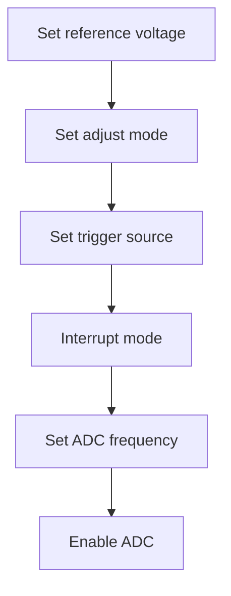
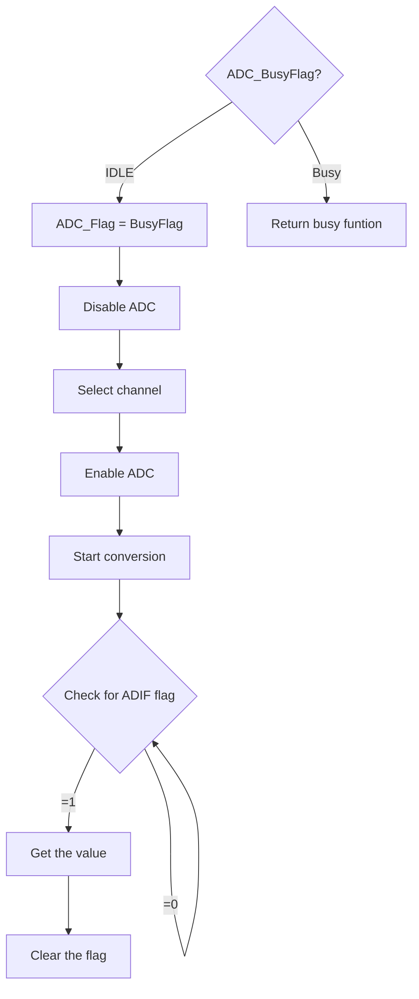

# Driver Functions

## 1) `ADC_Initiate()`



### Description

This function is used to initiate ADC with configurations that set at `ADC_Config.h`

### Syntax

`ADC_Initiate();`

### Parameters

`void`

### Returns

`void`

### 2) `ADC_StartConversionSynch()`




### Description

This function is used to get the ADC value by using busy waiting

### Syntax

`ADC_StartConversionSynch(channel,&ADCReadingVal)`

### Parameters

1) **Channel** : This parameter select ADC channel                                                           `ADC_SINGLE_ENDED_ADC0`	`ADC_SINGLE_ENDED_ADC1`	`ADC_SINGLE_ENDED_ADC2`	
    `ADC_SINGLE_ENDED_ADC3`	`ADC_SINGLE_ENDED_ADC4`	`ADC_SINGLE_ENDED_ADC5`	
    `ADC_SINGLE_ENDED_ADC6`	`ADC_SINGLE_ENDED_ADC7`	`ADC_SINGLE_ENDED_VBG`	
    `ADC_SINGLE_ENDED_GND`	`ADC_DIFFRENTIAL_ADC00_10X` `ADC_DIFFRENTIAL_ADC10_10X`	
    `ADC_DIFFRENTIAL_ADC00_200X`	`ADC_DIFFRENTIAL_ADC10_200X`	`ADC_DIFFRENTIAL_ADC22_10X`		
    `ADC_DIFFRENTIAL_ADC32_10X`	`ADC_DIFFRENTIAL_ADC22_200X`  `ADC_DIFFRENTIAL_ADC32_200X`
    `ADC_DIFFRENTIAL_ADC01_1X`	`ADC_DIFFRENTIAL_ADC11_1X`	`ADC_DIFFRENTIAL_ADC21_1X`	
    `ADC_DIFFRENTIAL_ADC31_1X`	`ADC_DIFFRENTIAL_ADC41_1X`	`ADC_DIFFRENTIAL_ADC51_1X`	
    `ADC_DIFFRENTIAL_ADC61_1X`	`ADC_DIFFRENTIAL_ADC71_1X`	`ADC_DIFFRENTIAL_ADC02_1X`	
    `ADC_DIFFRENTIAL_ADC12_1X`	`ADC_DIFFRENTIAL_ADC22_1X`	`ADC_DIFFRENTIAL_ADC32_1X`	
    `ADC_DIFFRENTIAL_ADC42_1X`	`ADC_DIFFRENTIAL_ADC52_1X`	
2) **ADCReadingVal** : Address of the variable that will store the ADCVal

### Returns

1.`BusyFunction` : in case of ADC is working on another conversion

2.`-1` : in case of ADC flag is not set (probably, hardware problem in ADC peripheral ) 

### Example Code

```c
uint16_t ADC_ReadingVal;
ADC_Initiate();
ADC_StartConversionSynch(ADC_SINGLE_ENDED_ADC0,&ADC_ReadingVal);
```


### Notes and Warnings

your code will be stopped at this function until the ADC conversion complete


## 3) `ADC_StartConversionAsynch()`

### Description

This function is used to start conversion using ADC_Interrupt

### Syntax

`ADC_StartConversionAsynch(Channel, ISR_Function);`

### Parameters

1) **Channel** : This parameter select ADC channel                                                           `ADC_SINGLE_ENDED_ADC0`	`ADC_SINGLE_ENDED_ADC1`	`ADC_SINGLE_ENDED_ADC2`	
    `ADC_SINGLE_ENDED_ADC3`	`ADC_SINGLE_ENDED_ADC4`	`ADC_SINGLE_ENDED_ADC5`	
    `ADC_SINGLE_ENDED_ADC6`	`ADC_SINGLE_ENDED_ADC7`	`ADC_SINGLE_ENDED_VBG`	
    `ADC_SINGLE_ENDED_GND`	`ADC_DIFFRENTIAL_ADC00_10X` `ADC_DIFFRENTIAL_ADC10_10X`	
    `ADC_DIFFRENTIAL_ADC00_200X`	`ADC_DIFFRENTIAL_ADC10_200X`	`ADC_DIFFRENTIAL_ADC22_10X`		
    `ADC_DIFFRENTIAL_ADC32_10X`	`ADC_DIFFRENTIAL_ADC22_200X`  `ADC_DIFFRENTIAL_ADC32_200X`
    `ADC_DIFFRENTIAL_ADC01_1X`	`ADC_DIFFRENTIAL_ADC11_1X`	`ADC_DIFFRENTIAL_ADC21_1X`	
    `ADC_DIFFRENTIAL_ADC31_1X`	`ADC_DIFFRENTIAL_ADC41_1X`	`ADC_DIFFRENTIAL_ADC51_1X`	
    `ADC_DIFFRENTIAL_ADC61_1X`	`ADC_DIFFRENTIAL_ADC71_1X`	`ADC_DIFFRENTIAL_ADC02_1X`	
    `ADC_DIFFRENTIAL_ADC12_1X`	`ADC_DIFFRENTIAL_ADC22_1X`	`ADC_DIFFRENTIAL_ADC32_1X`	
    `ADC_DIFFRENTIAL_ADC42_1X`	`ADC_DIFFRENTIAL_ADC52_1X`	
2) **ISR_Function**: Function that will be executed when ADC conversion completes

### Returns

1.`BusyFunction` : in case of ADC is working on another conversion

2.`NullPointer`: in case of the passed function isn't exist

3.`NoError` : in case of function is executed successfully

### Example Code

```c
void main(void)
{
    ADC_Initiate();
    ADC_StartConversionAsynch(ADC_SINGLE_ENDED_ADC0, ADC_Function);
}
void ADC_Function(void)
{
    /*Write your own code here*/
}
```

### Notes and Warnings

**The value of ADC reading is get by using this variable `ADC_ReadingValue`**

